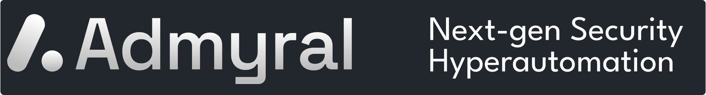
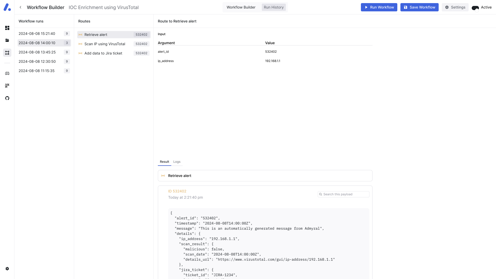

<p align="center">

</p>

<div align="center">
  <div>
    <h3>
        <a href="https://docs.admyral.dev/"><strong>Docs</strong></a> ·
        <a href="https://discord.gg/GqbJZT9Hbf"><strong>Discord</strong></a> ·
        <a href="https://github.com/Admyral-Security/admyral-quickstart"><strong>Quickstart</strong></a>
    </h3>
  </div>
  <div>


  </div>
</div>

</br>

## Quick start 🚀

Install Admyral:

```bash
$ pip install admyral
```

Start Admyral to access the frontend, execute workflows using Admyral's scalable workflow infrastructure:

```bash
$ admyral up
```

> [!IMPORTANT]
> Admyral is built with Python 3.12 and requires Docker to be installed on your machine. \
> If you don't have Docker installed, you can download it [here](https://docs.docker.com/get-docker/). \
> If you don't have Python 3.12 installed, you can download it [here](https://www.python.org/downloads/) or use your favorite package manager (e.g., `brew`).

More instructions on self-hosting with Docker can be found [here](https://docs.admyral.dev/docker), and for the development setup, click [here](https://docs.admyral.dev/development_setup).

## Simple, reliable Security Engineering using Admyral's Python SDK

### Automation-as-Code 🧑‍💻

<p align="center">

</p>

### AI Workflows 🤖

Empower your workflows with AI! Admyral supports custom AI Actions using top-tier LLMs from OpenAI, Mistral, Anthropic, and more. You can use these AI Actions within your workflow to summarize findings, create a report, categorize alerts, and much more.

### No-Code Editor Sync -- Bi-directional 👈 👉

While Admyral is Code-First, there is No-Code functionality as well. Visualize your coded workflows and edit them directly in the drag-and-drop workflow builder. All changes are synced back into your code.


### Workflow Monitoring 🔮



### Reliable and Scalable Workflow Infrastructure Out-of-the-box 📦

Built on [Temporal](https://temporal.io/) (used by Netflix, Retool, and co.), Admyral ensures reliable, scalable workflows -- incl. secrets management for integrations.
Deploy in under 5 minutes without infrastructure or scalability worries.

### Start Automating Any Workflow - SecOps or GRC 🎬

Make your _security operations_ more efficient, accomplish more with less resources, and standardize the quality of your SOPs.

When automating workflows in _GRC/Compliance_, reduce the effort for IT-dependent manual controls.

Example workflows can be found in [examples/playbooks/workflows](https://github.com/Admyral-Security/admyral/tree/main/examples).

## 📃 License

This repository is licensed under Apache License 2.0. See [LICENSE](https://github.com/Admyral-Security/admyral/blob/main/LICENSE) for more details.

## Misc

### Telemetry

Admyral automatically collects telemetry data using PostHog with hosting in the EU. We want to emphasize that no personal data is sent to PostHog. The data helps us to understand how Admyral is used and improve our most relevant features as well as track the overall usage for internal and external reporting.

None of data is shared with third parties and does not include any sensitive information. If you would like to opt-out of telemetry or have questions, please reach out to us via [chris@admyral.dev](mailto:chris@admyral.dev) or contact us on Discord, as we want to be transparent and respect your privacy.

You can opt-out by simply setting `ADMYRAL_DISABLE_TELEMETRY` to `true` in your environment variables.
