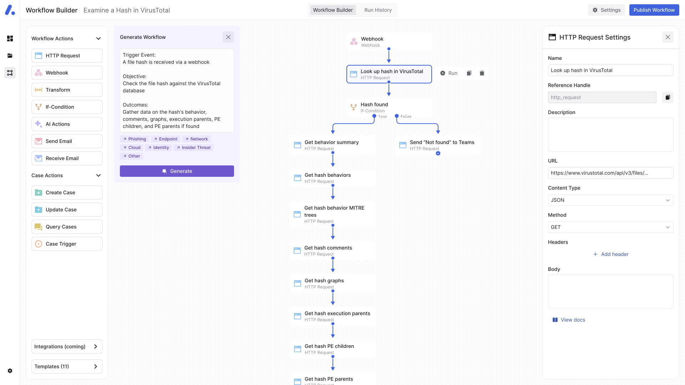

<p align="center">

</p>

<div align="center">
  <div>
      <a href="https://admyral.dev/login"><strong>Login</strong></a> ·
      <a href="https://docs.admyral.dev/"><strong>Docs</strong></a> ·
      <a href="https://discord.gg/GqbJZT9Hbf"><strong>Discord</strong></a> ·
      <a href="https://join.slack.com/t/admyralcommunity/shared_invite/zt-2hqxj1xrr-YoWXYq7t8l3i5GyTCzEwPg"><strong>Slack</strong></a>
  </div>
  <div>

[](https://discord.gg/GqbJZT9Hbf)


  </div>
</div>

</br>

Admyral is an open-source Cybersecurity Automation & Investigation Assistant. Admyral's Assistant enjoys a deep integration into Admyral's case management and workflow automation. Through this triangulation, SOC teams can benefit from:

1. A unified console to perform investigations and handle incidents 📺
2. A seamless workflow automation creation -- even during incident triage, investigation, or response 👷
3. Automatic alert investigation as well as next step suggestions for analysts 🧑‍✈️
4. Recommendations for automating workflows 🤖

Through Admyral's Assistant functionality, Admyral seeks to provide a new, more effective, and scalable approach for tackling alert fatigue and automating security workflows.

→ → → [Try out the free cloud version](https://admyral.dev/login) ← ← ←

Here is a sneek-peak into the workflow automation builder:


## 🗺️ Key Features & Roadmap

### Hyperautomation Platform Foundation

-   [ ] Workflow Actions
    -   [x] HTTP request
    -   [x] Manual and event-based workflow start
    -   [x] Credential Management for HTTP Requests
    -   [x] If-Condition
    -   [x] AI Actions
    -   [x] Send Emails
    -   [ ] Scheduling
    -   [ ] Case Actions (Create Case, Update Case, etc.)
    -   [ ] Receive Emails
    -   [ ] Data Transformations
    -   [ ] Formulas
    -   [ ] Custom Python code
-   [x] Run history
-   [ ] Case Management
-   [ ] Alert Handling
-   [ ] Dashboard

### Next-Gen Hyperautomation Features

-   [x] Natural Language to Workflow Automation
-   [ ] Incident Investigation Assistant
-   [ ] AI-proposed next steps on handling an incident/a case
-   [ ] Customized workflow automation recommendations

### Integrations

Available Integrations: VirusTotal, AlienVault, Slack, ThreatPost, YARAify, Phish Report

Many more integrations are coming soon such as URLHaus, URLScan, GreyNoise, AbuseIPDB, Jira, MS Defender, SentinelOne, AWS Cloudtrail to name a few.
What integrations are missing for you? Let us know on [Discord](https://discord.gg/GqbJZT9Hbf) or [chris@admyral.dev](mailto:chris@admyral.dev) about your use-case and we will build it within one week! 


### Hosting

-   [x] Cloud version
-   [x] Self-hosting

### Misc

-   [ ] Multi-tenancy for MSSPs

### Admyral in <5 Minutes

// A demo is coming at the end of May 2024

## 🚀 Get Started

### Admyral Cloud
Managed deployment by the Admyral team, free, no credit card required.

**[» Admyral Cloud](https://admyral.dev/)**


### Self-hosting with Docker

```bash
# Clone the repository
git clone https://github.com/Admyral-Security/admyral.git
 
# Change directory to docker self-hosting
cd admyral/deploy/selfhosting
 
# Copy the env vars
cp .env.example .env
 
# Start the services in detached mode
docker compose up -d
```

[» Learn more about deploying locally](https://docs.admyral.dev/setup/docker)


## 💬 Feedback & Contributing to Admyral

We value your feedback and contributions! If you have suggestions, questions, or would like to discuss anything related to Admyral, just text us on [Discord](https://discord.gg/GqbJZT9Hbf) or [Slack](https://join.slack.com/t/admyralcommunity/shared_invite/zt-2hqxj1xrr-YoWXYq7t8l3i5GyTCzEwPg).

You can best support this project by:

1. Giving it a star on GitHub
2. Joining our active community on [Discord](https://discord.gg/GqbJZT9Hbf) and/or [Slack](https://join.slack.com/t/admyralcommunity/shared_invite/zt-2hqxj1xrr-YoWXYq7t8l3i5GyTCzEwPg)
3. And giving us feedback

## ❓ FAQ

#### What is the issue with the current Security Automation tools?

1. **Challenges of Staffing in Security Automation Implementation**:
   Security automation platforms promised to reduce the burden on security teams. However, they still require a dedicated team for building and managing automations, not addressing the ongoing issue of a skilled worker shortage.

2. **Automation Builders & Requesters vs. Automation Users**:
   Security Engineers are tasked with building automations while Managers drive their development based on input from the end users, aka Security Analysts. To complicate this, there's a lack of a feedback loop among these groups.

3. **Inflexibility of Static Workflows in a Dynamic Threat Environment**:
   Existing security automation platforms originated from generic workflow builders and are designed for static environments and pre-GenAI era. In cybersecurity, where threats evolve rapidly, static workflows are inadequate. It is impossible to constantly maintain and update static and predefined workflows.

Overall, creating workflows should be made easier, more accessible, and faster. This enables automation users, e.g. Security Analysts, to effortlessly create workflows during their regular processes without creating additional overhead. To achieve this, we have to rethink the creation and overall concept of security automation. We believe that workflows is a dynamic concept that should welcome easy case-by-case adjustments during the incident investigation stage and beyond.

#### Why should security automation and case management be combined?

Security automation and case management are two sides of the same coin. Security automation is the process of automating security tasks, while case management is the process of managing security incidents. Combining the two allows for a more streamlined and efficient incident response process. By automating repetitive tasks and integrating automations into the case management process, security teams can respond to incidents more quickly and effectively. This integration also allows for better tracking and reporting of incidents, which can help organizations identify trends and improve their overall security posture.

#### How do you stay secure?

Visit [SECURITY.md](https://github.com/Admyral-Security/admyral/blob/main/SECURITY.md) for more details.

#### What does your pricing look like?

As Admyral is still in its public alpha phase, we have not finalized a specific pricing structure yet. We invite interested organizations to reach out directly via email at [chris@admyral.dev](mailto:chris@admyral.dev) or [Discord](https://discord.gg/GqbJZT9Hbf)/[Slack](https://join.slack.com/t/admyralcommunity/shared_invite/zt-2hqxj1xrr-YoWXYq7t8l3i5GyTCzEwPg) to discuss potential use cases and explore custom pricing options based on their needs and the scale of implementation.

#### Why is Admyral open-source?

We are open-source for the following reasons:

-   To establish transparency and trust with our users
-   To enable the community to self-host and contribute to Admyral
-   To collaborate on integrations and features with the community because users know best what a Cybersecurity Automation & Investigation Assistant should look like
-   To secure small- and medium-sized businesses, that have no budget for security

#### Does Admyral stay open-source?

We love open-source. Therfore, Admyral stays committed to keep all open-sourced features freely available under the same open-source terms and maintain them. However, future premium features may only be part of our enterprise version. For specific requirements, please reach out to us via [chris@admyral.dev](mailto:chris@admyral.dev).

## 🏙️ Enterprise Version

_Disclaimer_: Admyral is still in public alpha. If you'd like to use it within your company or try it out, reach out to us via [chris@admyral.dev](mailto:chris@admyral.dev) or directly on [Discord](https://discord.gg/GqbJZT9Hbf)/[Slack](https://join.slack.com/t/admyralcommunity/shared_invite/zt-2hqxj1xrr-YoWXYq7t8l3i5GyTCzEwPg).

As of now, our project does not have a dedicated Enterprise version.
If you represent an MSSP or an Enterprise and would like to discuss potential collaborations with Admyral, please do not hesitate to reach out directly at [chris@admyral.dev](mailto:chris@admyral.dev) to start a conversation.
We are excited about the possibility of working together to meet your specific business needs and to expand the capabilities of our project in a way that benefits your organization.

## 📃 License

This repository is licensed under Apache License 2.0. See LICENSE for more details.

## Misc

### Telemetry

Admyral automatically collects telemetry data using PostHog with hosting in the EU. We want to emphasize that no personal data is sent to PostHog. The data helps us to understand how Admyral is used and improve our most relevant features as well as track the overall usage for internal and external reporting.

None of data is shared with third parties and does not include any sensitive information. If you would like to opt-out of telemetry or have questions, please reach out to us via [chris@admyral.com](mailto:chris@admyral.dev) or contact us either on Discord or Slack, as we want to be transparent and respect your privacy.

For self-hosting, you can opt-out by simply removing `NEXT_PUBLIC_POSTHOG_KEY` and `NEXT_PUBLIC_POSTHOG_HOST` from the environment variables.
