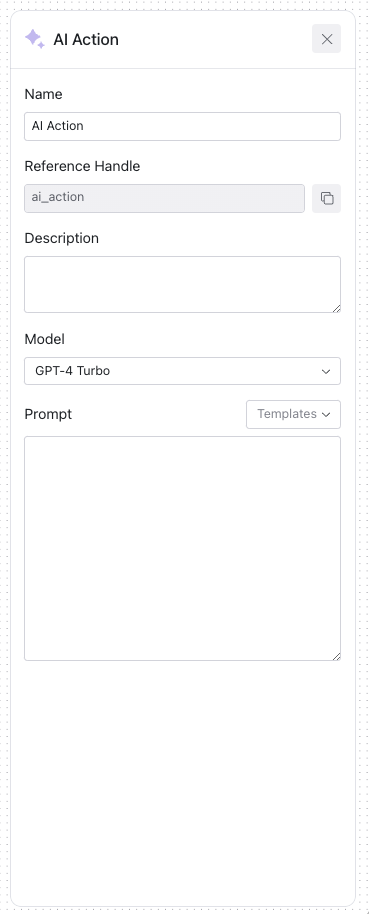

# AI Action

An AI Action enables the integration of advanced AI models into your workflows for tasks such as categorization, analysis, or decision support. 
This action can utilize the power of LLMs to assist in responding to events, processing information, or providing automated interactions within your security 
operations.

## Configurable Fields for AI Action

| Field              | Description                                                                 | Configurable |
|--------------------|-----------------------------------------------------------------------------|:------------:|
| **Name**           | The name of the AI Action, signifying its function within the workflow.     |      Yes     |
| **Reference Handle** | An internal identifier to reference the AI Action in scripts or integrations.|      -     |
| **Description**    | A brief explanation for documentation purposes of what the AI action is tasked to do.       |      Yes     |
| **Model**          | The specific AI model chosen for the action. Currently supports OpenAI's GPT-4 Turbo and GPT-3.5 Turbo. |      Yes     |
| **Prompt**         | The input prompt that guides the AI in generating the desired output.       |      Yes     |

     
    

_Webhook Configuration_

### Model Selection 
Users can currently choose between two leading large language models: GPT-4 Turbo and GPT-3.5 Turbo, depending on their needs and 
the complexity of the task.
In most cases it is recommended to use GPT4-Turbo for increase performance.

### Prompt Templates
To streamline the creation process, users can select from a range of prompt templates tailored to common tasks, with more templates to be added in the future.

## Token Limitation and Usage

There is a limit to the number of tokens that can be processed in a single prompt. This ensures efficient operation and resource usage. If your use case requires a higher token limit, please reach out on Discord, and we can discuss lifting your usage limit accordingly.

## AI Action Examples

### Example 1: Phishing Email Analysis
* **Name**: `Phishing Email Analysis`
* **Description**: `Analyzes the content of an email to determine if it's a phishing attempt.`
* **Model**: `GPT-4 Turbo`
* **Prompt**: `"Review the following email content and assess for phishing indicators: ..."`

### Example 2: Incident Summary Generation
* **Name**: `Incident Summary Generation`
* **Description**: `Generates a concise summary of a security incident for reporting purposes.`
* **Model**: `GPT-4 Turbo`
* **Prompt**: `"Summarize the following security incident details into a report: ..."`

### Example 3: Automated Response Drafting
* **Name**: `Automated Response Drafting`
* **Description**: `Creates a draft response to a security alert notification.`
* **Model**: `GPT-3.5 Turbo`
* **Prompt**: `"Compose a response to the security alert with these details: ..."`

Remember to handle AI-generated content with the same scrutiny and validation as you would any other source, ensuring that it aligns with your 
security protocols and standards.
