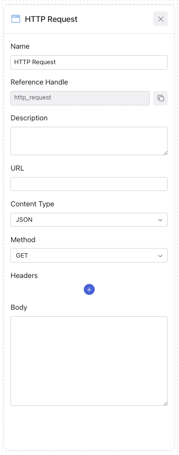

# HTTP Request 

An HTTP Request action is used to communicate with web services by making requests. This action can send or receive data to perform 
various operations, such as retrieving information or triggering a process in response to a security event.

## Configurable Fields for HTTP Request

| Field              | Description                                                                   | Configurable |
|--------------------|-------------------------------------------------------------------------------|:------------:|
| **Name**           | The name of the HTTP request, indicating its role in the workflow.             |      Yes     |
| **Reference Handle** | An internal identifier used to reference the HTTP request in code or integrations. |      -     |
| **Description**    | A description of what the HTTP request does or what it's used for.            |      Yes     |
| **URL**            | The endpoint to which the HTTP request will be sent.                          |      Yes     |
| **Content Type**   | The format of the data that is being sent. JSON is currently supported.       |      Yes     |
| **Method**         | The type of HTTP method used. GET and POST are currently supported.           |      Yes     |
| **Headers**        | Custom headers that may be required by the endpoint, like authentication tokens. |      Yes     |
| **Body**           | The data payload for requests, formatted according to the Content Type.       |      Yes     |

     
    

_HTTP Request Configuration_

## HTTP Request Examples

### Example 1: Blacklist IP Address
* **Name**: `Blacklist IP Address`
* **Description**: `Automatically adds a malicious IP address to the firewall's blacklist.`
* **URL**: `https://firewall.example.com/api/blacklist`
* **Content Type**: `application/json`
* **Method**: `POST`
* **Headers**: `"Authorization": "Bearer xyz123Token"`
* **Body**: `"ip_address": "192.168.1.1"`

### Example 2: Scan Network
* **Name**: `Scan Network for Vulnerabilities`
* **Description**: `Initiates a network vulnerability scan after receiving a threat alert.`
* **URL**: `https://vulnerabilityscanner.example.com/api/scan`
* **Content Type**: `application/json`
* **Method**: `POST`
* **Headers**: `"Api-Key": "scannerApiKey"`
* **Body**: `"network_segment": "10.0.0.0/24"`

### Example 3: Fetch Incident Report
* **Name**: `Fetch Incident Report`
* **Description**: `Retrieves the latest incident report for analysis from the incident reporting tool.`
* **URL**: `https://incidentreporter.example.com/api/reports/latest`
* **Content Type**: `application/json`
* **Method**: `GET`
* **Headers**: `"Accept": "application/json", "Authorization": "Basic abc123Auth"`
* **Body**: None required for GET request.

These examples demonstrate how the HTTP Request action can be configured to automate different tasks within a security workflow, from proactive 
threat mitigation to reactive incident response.

## Sensitive Request Information (API Keys, Credentials, etc.)

Ensure that all sensitive information, like API keys or credentials, are secured and encrypted if they are to be included 
in the headers or body of the request. To ensure this, refer to [Credentials](/credentials). 

