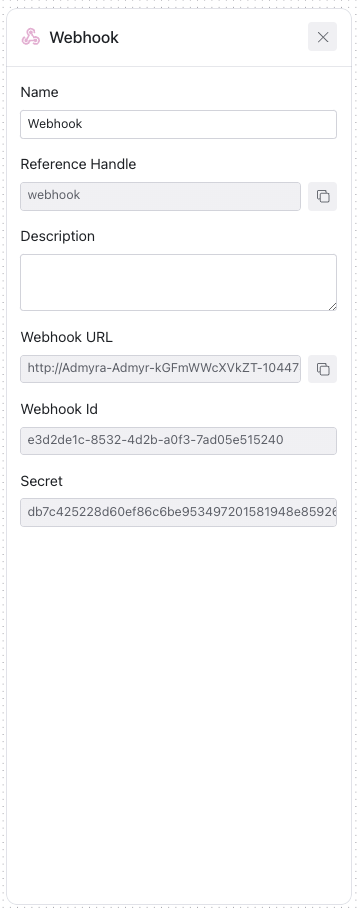

# Webhook 

A Webhook action sends information to other websites automatically when something happens, like an alert or update, without needing to manually check for it.

## Configurable Fields for Webhook

| Field            | Description                                                                 | Configurable |
|------------------|-----------------------------------------------------------------------------|:------------:|
| **Name**         | The name of the webhook, typically reflecting its purpose in the workflow.   |      Yes     |
| **Reference Handle** | A programmable handle used in scripts or APIs to identify the webhook.      |      -     |
| **Description**  | A short explanation of what the webhook is used for, especially in complex workflows. |      Yes     |
| **Webhook URL**  | The destination URL where the webhook payload is sent.                      |      -     |
| **Webhook ID**   | A unique identifier assigned to the webhook, used for tracking and management. |      -      |
| **Secret**       | A security token used to validate the integrity and origin of the payload.   |      -     |

     
    

## Webhook Examples

### Example 1: Intrusion Detection Alert
* **Name**: "Intrusion Detection Alert"
* **Description**: "Notifies the security orchestration tool when the intrusion detection system flags abnormal activity."

### Example 2: Failed Login Notification
* **Name**: "Failed Login Notification"
* **Description**: "Sends a notification when the system records a specified number of failed login attempts, indicating a potential brute force attack."

### Example 3: New Vulnerability Report
* **Name**: "New Vulnerability Report"
* **Description**: "Triggers a workflow in the vulnerability management system when a new vulnerability is published that affects the organization's assets."

