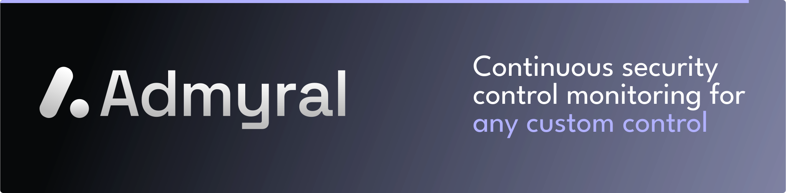

# Overview

> Admyral is an open-source Cybersecurity Automation & Investigation Assistant. It combines workflow automations, case management, and the Admyral Assistant.

## Core Platform Features

### Workflow builder

-   **Workflow Automations**: Intuitively drag and drop workflow actions to build an automation workflow
-   **AI Workflows**: Build AI-enhanced workflows using GPT4
-   **Run History**: Analyze your workflow run history
-   **Case Management Integration**: Case management specific actions such as "Open Case" or "Update Case" (_coming soon_)
-   **Integrations**: Leverage pre-built integrations to speed up your automation efforts (_coming soon_)

### Case Management

_Coming in May 2024_

### Admyral Assistant

_First features are coming in May/June 2024_

## Getting Started

import { Callout } from "nextra/components";

<Callout type="info">
	Self-hosting of Admyral will be available in May 2024. Until
	then, we recommend to use the [cloud version](www.google.com) (free).
</Callout>

## Getting in Touch & Updates

Admyral evolves quickly, check out the announcements in [Discord](https://discord.gg/GqbJZT9Hbf)/[Slack](https://join.slack.com/t/admyralcommunity/shared_invite/zt-2hqxj1xrr-YoWXYq7t8l3i5GyTCzEwPg) for the latest updates.

Reach out to us in [Discord](https://discord.gg/GqbJZT9Hbf)/[Slack](https://join.slack.com/t/admyralcommunity/shared_invite/zt-2hqxj1xrr-YoWXYq7t8l3i5GyTCzEwPg) or via email at [chris@admyral.dev](mailto:chris@admyral.dev) for feedback, feature requests, bugs, partnerships, etc.
