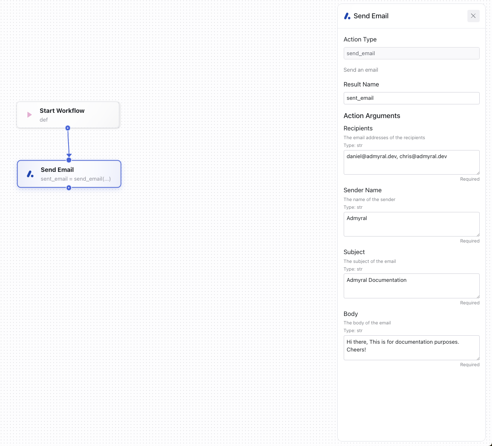
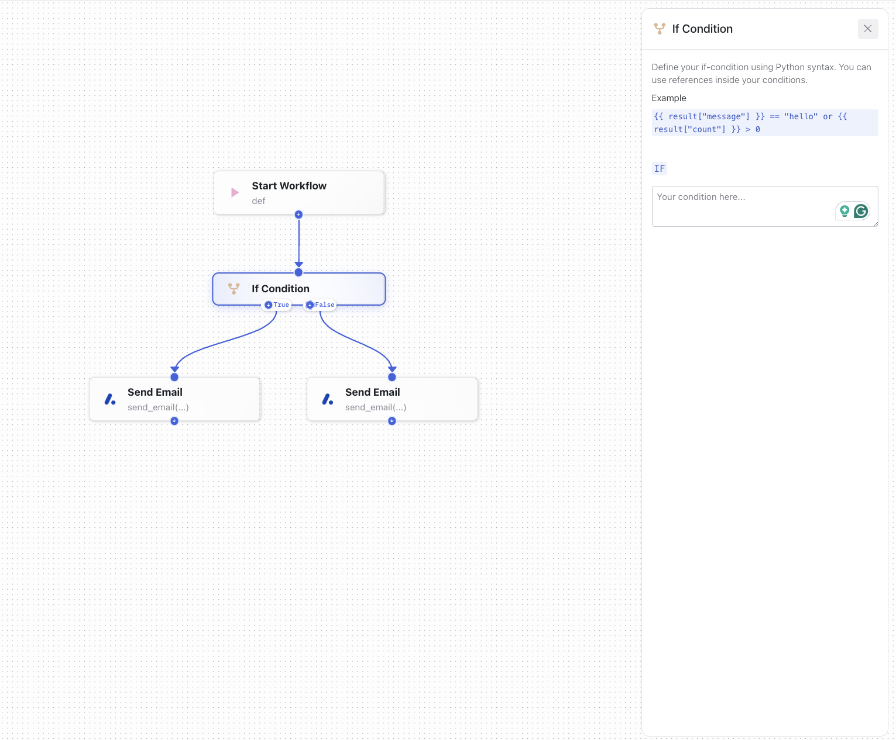
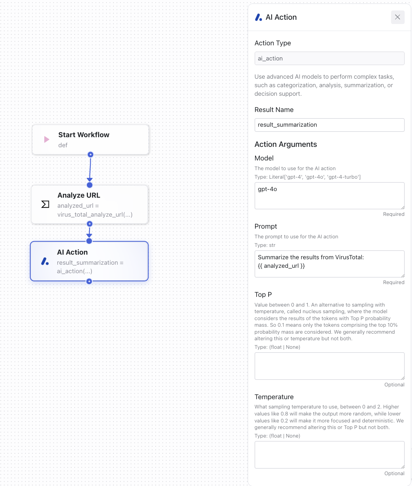

import { Callout } from "nextra/components";
import { Tabs } from "nextra/components";

# Pre-defined Actions

Admyral provides pre-defined actions to enable you to get started quickly. They are out-of-the-box actions to facilitate the creation of automations.

<Callout type="info">
	Within your coded automations, you can use pre-defined actions directly
	within the `@workflow` function.
</Callout>

## Send Email

Send emails as part of an automation.

| Parameter     | Type | Description                                                                                                                                                         |
| ------------- | ---- | ------------------------------------------------------------------------------------------------------------------------------------------------------------------- |
| `recipients`  | str  | The email addresses of the recipients. This should be a single string containing one or more email addresses, separated by commas if there are multiple recipients. |
| `sender_name` | str  | The name of the sender. This name will appear in the "From" field of the email.                                                                                     |
| `subject`     | str  | The subject of the email. This will be displayed in the subject line of the email.                                                                                  |
| `body`        | str  | The body of the email. This is the main content of the email message.                                                                                               |

**Response**: The response from the `resend.Emails.send()` method, typically a JSON object indicating the status of the email sending operation.

<Tabs items={['Code Example', 'No-Code Example']}>
    <Tabs.Tab>
        ```python
        import ... TODO

        @workflow
        def example_workflow(): # previous workflow logic
        email = send_email(
        recipients="daniel@admyral.dev, chris@admyral.dev",
        sender_name="Admyral",
        subject="Admyral Documentation",
        body="Hi there, This is for documentation purposes. Cheers!"
        )
        ````

  </Tabs.Tab>
  <Tabs.Tab>
    <div align="center">
	    <br />
	    
    </div>
    _No-Code Editor: Send Email_
  </Tabs.Tab>
</Tabs>

## If-Condition

Create if-branches within your automations.

<Tabs items={['Code Example', 'No-Code Example']}>
    <Tabs.Tab>
        Simply stick with the python-based if-statements.

        ```python
        import ...

        @workflow
        def example_workflow():
            # previous workflow logic
            if result == True:
                # do this
            else:
                # to that
        ```

  </Tabs.Tab>
  <Tabs.Tab>
    <div align="center">
	    <br />
	    
    </div>
    _No-Code Editor: If Condition_
  </Tabs.Tab>
</Tabs>

## AI Action

Use advanced AI models to perform complex tasks, such as categorization, analysis, summarization, or decision support.
The pre-defined AI Action only supports OpenAI's latest models provided by Admyral (Cloud version only). To use other models from providers like Mistral AI, Anthropic, or Azure OpenAI, use the actions
from the interaction screen. For these, an API key is required.

| Parameter     | Type          | Description                                                                                                                                                                     | Required/Optional |
| ------------- | ------------- | ------------------------------------------------------------------------------------------------------------------------------------------------------------------------------- | ----------------- |
| `model`       | Literal       | The model to use for the AI action. Options include `"gpt-4"`, `"gpt-4o"`, `"gpt-4-turbo"`.                                                                                     | Required          |
| `prompt`      | str           | The prompt to use for the AI action. This will be the input text that the model processes.                                                                                      | Required          |
| `top_p`       | float or None | Value between 0 and 1. An alternative to sampling with temperature, called nucleus sampling, where the model considers the results of the tokens with Top P probability mass.   | Optional          |
| `temperature` | float or None | Sampling temperature to use, between 0 and 2. Higher values like 0.8 will make the output more random, while lower values like 0.2 will make it more focused and deterministic. | Optional          |

**Response:** The generated response from the AI model based on the provided prompt and parameters as a str.

<Tabs items={['Code Example', 'No-Code Example']}>
    <Tabs.Tab>
        ```python
        import ...

        @workflow
        def example_workflow():
            # previous workflow logic incl. a request to VirusTotal saved in `virustotal`
            ai_action(
                model="gpt-4o",
                prompt="summarize the findings from virustotal: f{virustotal.output}"
            )
        ```

  </Tabs.Tab>
  <Tabs.Tab>
    <div align="center">
	    <br />
	    
    </div>
    _No-Code Editor: AI Action_
  </Tabs.Tab>
</Tabs>

## Deserialize JSON String

Deserializes a JSON String / transforms a string to an object.

| Parameter | Type | Description                    | Required/Optional |
| --------- | ---- | ------------------------------ | ----------------- |
| `str`     | str  | The string to be deserialized. | Required          |

<Tabs items={['Code Example', 'No-Code Example']}>
    <Tabs.Tab>
        ```python
        import ...

        @workflow
        def example_workflow():
            # previous workflow logic incl. a serialized JSON string saved in `example_string`
            value = deserialize_json_string(
                serialized_json=example_string
            )
        ```

  </Tabs.Tab>
  <Tabs.Tab>
    TODO 
  </Tabs.Tab>
</Tabs>
