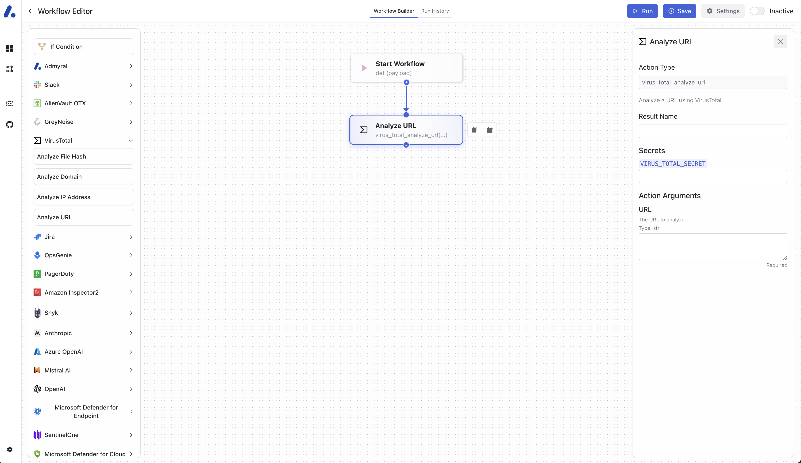

import { Steps } from "nextra/components";
import { Tabs } from "nextra/components";
import { Callout } from "nextra/components";

# Quickstart: Run Your First Workflow

This quickstart helps you to create your first workflow within Admyral. The workflow checks a simple URL check using the community version of VirusTotal.

**Prerequisites**:

-   Python 3.8 or higher
-   Docker

## Getting Started

You can create your first workflow within less than 10 minutes:

<Steps>
### Step 1: Installing and Starting Admyral

To install Admyral, simply navigate to your wished directory in your terminal (hint: use `cd <your_path>`) and enter the following:

```bash
pip install admyral
```

To start Admyral use the following command:

```bash
admyral up
```

You should then see the Admyral web app interface when you open `localhost:3000` in your browser.

Note: If port 3000 is occupied, check out `localhost:3001`.

### Step 2: Tool and Secret Setup

Now, let's get the VirusTotal API Key. If you don't have a VirusTotal account, sign up [here](https://www.virustotal.com/gui/join-us) for free.
Then click on your name on the top right, select `API Key`, and copy your api key.

With Admyral offering an _CLI_ as well as a _web interface_, you can select how you'd like to set up your VirusTotal secret.

<Tabs items={['Code', 'No-Code']}>
    <Tabs.Tab>
        To create a secret using the CLI, use the following CLI command: 
        ```bash 
        admyral secret set <secret_name> --value <key1>=<value1> --value <key2>=<value2>
        ```
        For our quickstart, navigate in your terminal to your admyral repository and enter the following but replacing `<your_copied_virus_total_api_key>` with your copied api key:
        ```bash
        admyral secret set virus_total --value api_key=<your_copied_virus_total_api_key>
        ```

    </Tabs.Tab>
    <Tabs.Tab>
        Go to Admyral running on [localhost:3000](localhost:3000). On the bottom left, click on settings and add your VirusTotal api key:
        1. Select "Add new secret"
        2. Secret name: `virus_total` (*any other name works as well*)
        3. Key: `api_key`
        4. Value: `<your_copied_virus_total_api_key>`
        5. Save it

     </Tabs.Tab>

</Tabs>

### Step 3: Create your workflow

As Admyral offers two options to create workflows, you can pick from below: (1) Create your workflow using `Code` or (2) using the `No-Code` workflow builder.

<Tabs items={['Code', 'No-Code']}>
    <Tabs.Tab>

        Open Admyral within your IDE, navigate to TODO, and create a new Python file named `virus_total_workflow.py`.

        Within this newly created file, your new workflow automation is being created using Python code.

        Let's start with creating our workflow function. This function has the `@workflow` decorator and defines the the control flow of our workflow automation.

        ```python
        @workflow()
        def virus_total_workflow():
            # will be completed soon
        ```

        Additionally, we need the corresponding imports. In this case, it is `from admyral.workflow import workflow` for the workflow function as well as `from admyral.actions import virus_total` for the integration.
        For the latter, we are using the pre-built integration to analyze an url (`virus_total.analyze_url(url: str)`) which takes an url as a string such as `www.example.org` and returns a JSON. The return value is the regular return value you'd receive from the [VirusTotal Scan URL API](https://docs.virustotal.com/reference/scan-url).
        With this knowledge, we can know create the workflow using plain Python:

        ```python
        from admyral.workflow import workflow
        from admyral.actions import virus_total

        @workflow()
        def virus_total_workflow(payload: dict[str, JsonValue]):
            virus_total.analyze_url(payload["url"])
        ```

        To use our previously stored secret for virustotal, we add `secrets={"TOOL_SECRET": "<secret_name>"}` as the last argument of an integration. In our case, it would look like the following:

        ```python
        from admyral.workflow import workflow
        from admyral.actions import virus_total

        @workflow()
        def virus_total_workflow(payload: dict[str, JsonValue]):
            virus_total.analyze_url(
                payload["url"],
                secrets={"VIRUS_TOTAL_SECRET": "virus_total"}
            )
        ```

        Now, we need to add triggers and a description (optional) to the workflow automation. Triggers can either be event-based (a webhook), based on one or more schedules, based on manual execution, or a combination of them.
        In this quickstart, we opt to create a webhook:

        ```python
        from admyral.workflow import workflow
        from admyral.actions import virus_total

        @workflow(
            description="Analyze an URL using VirusTotal",
            triggers=[Webhook()]
        )
        def virus_total_workflow(payload: dict[str, JsonValue]):
            virus_total.analyze_url(
                payload["url"],
                secrets={"VIRUS_TOTAL_SECRET": "virus_total"}
            )
        ```

        Now, you have created the workflow. The last step is to push the workflow to the Admyral infrastructure.
        Within your terminal, write the following command:
        ```bash
        admyral workflow virus_total_workflow.py --push
        ```

    </Tabs.Tab>
    <Tabs.Tab>

        1. Go to `localhost:3000`. When this exact domain is displayed in your browser, you are on the workflow overview page.
        2. Click on `Create new workflow` on the top right.
        3. In Workflow Settings, give the workflow a name, e.g. `Quickstart - VirusTotal URL Analysis`, and save the workflow.
        4. On the left sidepanel, click on the VirusTotal dropdown and drag+drop the `Analyze url` action on the canvas.
        Then connect the start node with the newly created `Analyze url` action. It should look like the following:

        <div align="center">
            <br />
            
        </div>
        _No-Code Editor: Start and VirusTotal Analyze URL Action_

        To finish it off, the VirusTotal action has to be configured:
        1. Optional: Enter a result name to later reference on the output of the action, e.g. `analyzed_url`
        2. Enter the secret name for the action: `virus_total`
        3. Fill out the arguments, e.g., just URL in this case: `www.example.org`

        <Callout type="warning">
            When you enter an url in the URL field in VirusTotal's configuration panel on the right, everytime the workflow is executed, the same URL will be analyzed.
            To avoid this, you would like to leverage the input from the webhook (event-based execution of the workflow).
        </Callout>

        To create a dynamic input, you can refer to the input coming from the webhook. Whenever the webhook is called (= an event happened), we require to send an url with it as well.
        For this, click on the Start action and then on the "+" next to Webhook.

        To refer to a previous input, we use `{{ <input> }}`.
        With this in mind, we can reference the url dynamically within the VirusTotal action using the following reference: `{{ payload["url"] }}`.

        Note: *payload* is the Result Name of the Start node (see right sidepanel).

        Enter the reference above in the URL field for the VirusTotal action.

        Lastly click on "Save" on the top bar to save all the changes.
    </Tabs.Tab>

</Tabs>

**Finished!**

### Step 4: Execute Your Workflow

Upon building our workflow, you can activate and execute your workflow. Again, you have two options for each action: (1) Using the CLI or (2) using the no-code interface.

<Tabs items={['CLI', 'No-Code']}>
    <Tabs.Tab>
        #### Activate the workflow
        To activate a workflow type in the CLI:
        ```bash
        admyral workflow <your_workflow.py> --activate
        ```

        As we called the workflow file `virus_total_workflow.py`, type in the following:
        ```bash
        admyral workflow virus_total_workflow.py --activate
        ```

        #### Execute the workflow
        Upon activation, the workflow can be executed. The CLI command to trigger a workflow is:

        ```bash
        admyral workflow <your_workflow> --trigger
        ```

        So similar to above, the command to use is:
        ```bash
        admyral workflow virus_total_workflow.py --trigger
        ```

        TODO: How to add webhook data, e.g. the url?

    </Tabs.Tab>
    <Tabs.Tab>

        #### Activate the workflow

        Upon clicking on "Save", you can simply use the toggle on the top right to switch the workflow status from "Inactive" to "Active".

        #### Execute the workflow

        On the top right, click on "Run" to execute the workflow manually. A modal opens in which you can enter a payload. As the workflow requires the url
        and as we have used `{{ payload["url"] }}` as a reference, we have to add a test payload. The payload is in JSON format and looks like the following:

        ```json
        {
            "url": "www.example.org"
        }
        ```

        Copy the code above and paste it in the payload textbox that popped up. Click on "Run workflow" to start the execution.

        <Callout type="info">
            To see the details of the workflow execution, go to the [Run History](/run_history).
        </Callout>

        activate workflow
    </Tabs.Tab>

</Tabs>
</Steps>

Now, you have created your first workflow in Admyral. With this quickstart, you covered all concepts of Admyral. The missing concept is _Custom Actions_.
You can further read about it [here](/custom_actions).

## What now?

You can further explore Admyral in the following ways:

-   Enhance the workflow you just created:
    -   Add more URL checks using other enrichment tools such as AlienVault OTX
    -   Add a Slack integration to share your results within an threat intelligence channel or within your team
    -   Add a Jira integration to create a ticket with the findings
    -   Add an AI Action to summarize the findings (add API key in env file)
-   Explore [other example workflows](https://github.com/Admyral-Security/admyral/tree/main/examples)
-   Join the discussion on [Discord](https://discord.gg/GqbJZT9Hbf)
-   Build additional workflows using our other guides (_coming soon_)
