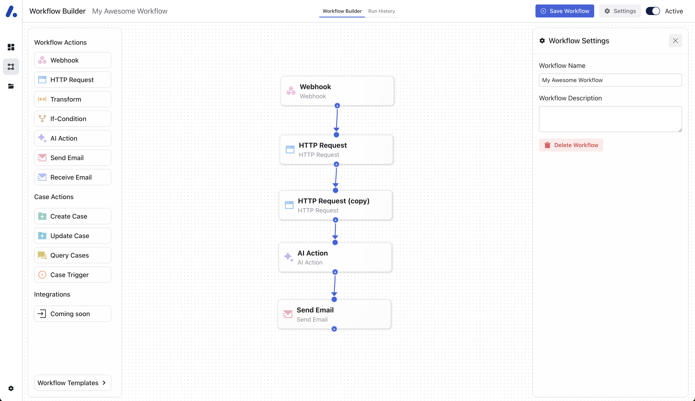
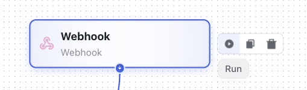

# Workflow Configuration

## Overview
- Consist of [actions](/actions/configuration)
- A chain of actions is called a workflow. When you executed a workflow, it is called workflow run. More about the latter in the [Run Histroy](/workflows/run_history)

## Workflow Builder
The workflow builder is split up in three parts. 
1. On the left panel, you can drag-and-drop new actions and integrations as well as select workflow templates from the [Workflow Library](/workflows/workflow_library).
2. In the middle, you can use the drag-and-drop functionality of the [actions](/actions/configuration) to build and adjust workflows 
3. On the right panel, you can make meta changes to the workflow such as changing the name of the workflow or adding an description. The right panel appears upon clicking on the "*Settings*" button on the top right.
However, if you have selected an action on the canvas in the middle, this panel changes and you can configure the action.

_Workflow Builder_

## Executing Workflows
When you build workflows, they should start with an input action. As soon as this input action is triggered, e.g. by an external API call in the case of a webhook, 
the workflow is executed automatically.

*Make sure you have activated the workflow for it to be able to execute!*

You can always test workflows manually to ensuring they are set up properly by clicking on an action and selecting "*Run*".

_Action Run_

