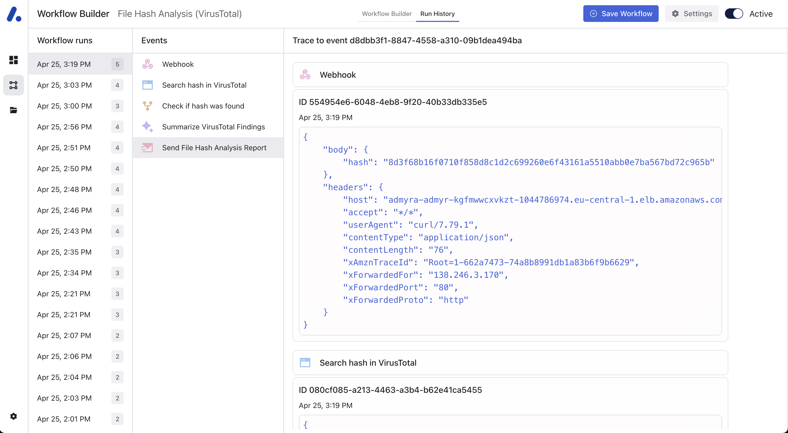

# Workflow Run History

## Reviewing Workflow Executions

To review the execution history of your workflows, follow these steps:

1. Access the **Workflow Runs** section from the Workflow Builder.
2. You will see a list of workflow runs with their corresponding dates and times for quick reference.

## Understanding Workflow Run Details

Each workflow run is listed with the following information:

- **Date, Time:** The exact date and time when the workflow was triggered.
- **Routes:** Displayed in the second column. A representation of the path that the workflow took during execution.
- **Action Details:** In the third column details of each executed action are displayed such as an action id, a timestamp, and the payload.

_Workflow Run History_

## Navigation Tips
To view detailed information about a particular run, click on the desired Date, Time entry and select the Route you are interested in.

